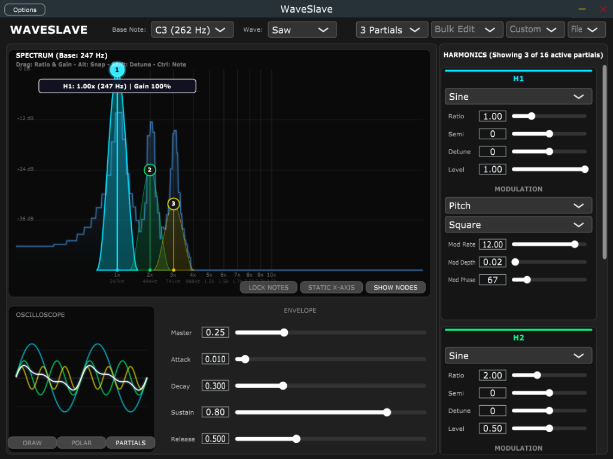
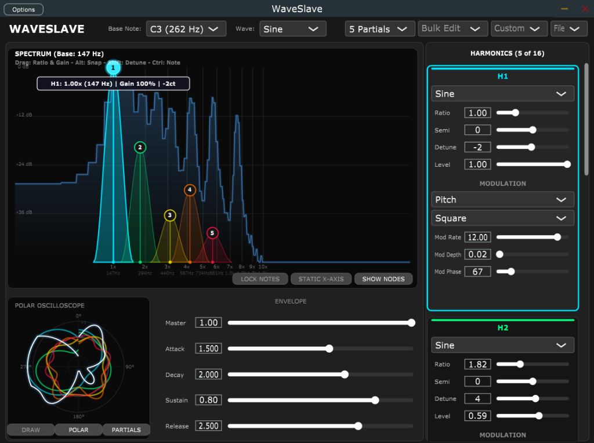

# WaveSlave

**WaveSlave** is a powerful, highly-customizable 16-partial additive synthesizer plugin built with C++ and the JUCE framework. It combines the mathematical precision of harmonic stacking with organic, per-partial modulation and the ability to hand-draw custom waveforms.

## Features

* **16-Partial Additive Synthesis**: Stack up to 16 individual sine, triangle, saw, or square waves to construct complex tones.
* **Custom Bezier Waveforms**: Draw your own base waveforms using an interactive Bezier curve editor. Supports both standard Cartesian graphing and **Polar (radial) coordinate drawing**!
* **Deep Harmonic Control**: 
  * Bulk edit harmonics into distinct mathematical series (Natural, Odd, Even, Octaves, Inharmonic/Bells).
  * Gain tilting (1/n, 1/n^2, flat).
  * Pitch spreading and subtle analog detuning.
* **Per-Partial Modulation**: Dedicated LFOs for *each* of the 16 partials. Target Pitch or Level, select LFO shape, rate, depth, and starting phase offset to create rich, evolving textures and chaotic metallic wobbles.
* **Interactive Visualizers**: Real-time oscilloscope (with standard and polar views) and spectrograph to visualize your sound in action.
* **Factory Presets**: Includes a library of handcrafted patches, from 8-bit chiptunes to lush pads, drawbar organs, and the chaotic "Too Much Glue!" preset.

## Examples



## Installation

You do not need to compile the code yourself to use WaveSlave! 

Compiled binaries are available in the **[Releases](../../releases)** tab for Windows:
* **Standalone Application** (`WaveSlave.exe`)
* **VST3 Plugin** (Drop into `C:\Program Files\Common Files\VST3`)

## Building from Source

If you want to build WaveSlave from source, you will need [CMake](https://cmake.org/) and a C++ compiler (like MSVC on Windows). The JUCE framework is automatically fetched via CMake, so you don't need to install it manually.

```bash
# 1. Clone the repository
git clone https://github.com/JacobHepworth/WaveSlave.git
cd WaveSlave

# 2. Configure the CMake project
cmake -B build

# 3. Build the Release configuration
cmake --build build --config Release
```

Once built, the binaries will be located in `build/WaveSlave_artefacts/Release/`.

## License

This project is licensed under the **GNU General Public License v3.0 (GPLv3)**. 

Because this project utilizes the free/open-source tier of the JUCE framework, it is strictly bound by the GPLv3 copyleft license. Any forks or derivative works must also be open-source and released under the GPLv3 license. See the `LICENSE` file for more details.
